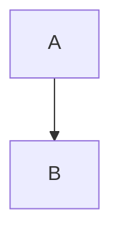

# GitHub Rendering Reference

Introductory paragraph with inline `code`, **bold text**, and _italic emphasis_.

---

## Lists and Quotes

- Bullet item one
- Bullet item two
  - Nested bullet item with `inline code`
- Bullet item three

1. Ordered step one
2. Ordered step two
3. Ordered step three

> Blockquote section including `quoted code` and multiple lines.
>
> Second paragraph of quote.

## Tables

| Name        | Alignment | Notes              |
| :---------- | --------: | :----------------: |
| Alpha       |         1 | General information |
| Beta        |        20 | `Inline` value      |
| Gamma Delta |       300 | Mixed **formatting** |

## Code Samples

```ts
function greet(name: string) {
  console.log(`Hello, ${name}!`);
}
```



```
No language code block
with two lines.
```

## Mathematics

Inline math $E = mc^2$ is supported.

$$
\int_0^1 x^2 \, dx = \frac{1}{3}
$$

### Final Notes

Text after math to confirm spacing and horizontal rule handling.

---

